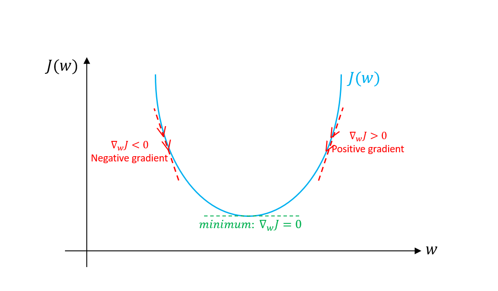

# Adaptive Linear Neuron (Adaline) or Widrow-Hoff Learning rule

This is a method based on the __Approximate Steepest Descent__ algorithm, where the performance index is the **Mean Square Error (MSE)**. It serves as the base to the Backpropogation algorithm for multilayer networks and it's widely used on most Digital Signal Processing applications. An example of such an application is the echo cancellation in long distance phone calls.

*Bernard Widrow* and his graduate student *Marcian Hoff* while researching on the Neural networks in late 1950's, introduced the **ADALINE** (ADaptive LInear NEuron) network, and a learning rule which they coined as **LMS** (Least Mean Square) algorithm.

The `ADALINE` network is quite similar to the `Perceptron`, except that it's `Activation Function` is `Linear`, instead of hard-limiting. But again similar to `Perceptron` this rule again has a limitation of solving only the linearly seperable data. But unlike the `Perceptron` which is guaranteed to converge to a solution that correctly categorizes the training patterns with a resulting network affetced by the noise (as patterns lie close to the deciion boundaies), the `LMS` algorithm  minimizes the mean square error and there by trying to move the decision boundaries as far away from the training patterns as posible.

## ADALINE Network

The basic structure of an `ADALINE` network is similar to that of a `Perceptron` except that of a `Linear Activation Function` as shouwn below

## Cost function (J)

In an `ADALINE` network, the input weights are updated based on a Linear Activation function rather the Unit Step function as in the `Perceptron`. Here, the true class labels are compared against the continuous valued output from a Linear Activation function for the computation of weight updates and errors.

In `Adaline`, the Linear Activation Function is simply the identity function of the net input as defined below.

The objective of the supervised machine learning algorithm is to optimize the defined **Objective function** during the learning process. This objective function is often referred to as a **Cost function**, that we would like to minimize. The`Cost function (J)` to learn the weights in case of an `Adaline` is based on the Sum of Squared Errors (SSE) between the calculated outcome and the true class label which is as defined below:

![e1]

This is a Continuous linear activation function with the advantage of the cost function being _differentiable_. Another advantage with this function is that it's convex in shape, facilitating for the use of `Gradient Descent` to find the weights which minimize our cost function for classifying the samples. The following figure provides an idea about how the gradient descent works.

As shown in the figure, the intention is to slide down the slanting surfaces until a local or a gloal cost minimum is reached. During each iteration, a step in the opposite direction of the gradient is taken at which point the step size (this is the learning rate) as well as the slope if determined.

The updated weights at each step may be found by using the gradient descent and taking the step in the opposite direction of the gradient of the cost function (`J(w)`).

> Gradient of the cost function `J(w)` = ![e2]
>
> Weight updates...
> ![e4]

As per the `calculus`, the weight change ![e3] is usually defined as the negative gradient multiplied by the learning rate ![e5]

In order the compute the gradient of our cost function, we have to compute the partial derivative of the cost function with respect to each of the weights ![e6] as follows:

![e7]

With this, the update to the weight ![e6] may be written as:

![e8]

In `Adaline`, the update to weight is calculated based on all the samples in the training set instead of updating the weights incrementally as in a `Perceptron`. This is the reason why this approach is also called as `Batch Gradient Descent`

[e1]: https://latex.codecogs.com/gif.latex?J%28w%29%3D%5Cfrac%7B1%7D%7B2%7D%5Csum_%7Bi%7D%28y%5E%7B%28i%29%7D-%5Cphi%28z%5E%7B%28i%29%7D%29%29%5E2
[e2]: https://latex.codecogs.com/gif.latex?%5Cnabla%7BJ%28w%29%7D
[e3]: https://latex.codecogs.com/gif.latex?%5Cnabla%7Bw%7D
[e4]: https://latex.codecogs.com/gif.latex?w%3A%3D%20w%20&plus;%20%5Cnabla%7Bw%7D
[e5]: https://latex.codecogs.com/gif.latex?%5Ceta
[e6]: https://latex.codecogs.com/gif.latex?w_j
[e7]: https://latex.codecogs.com/gif.latex?%5Cfrac%7B%5Cpartial%20J%7D%7B%5Cpartial%20%7Bw_j%7D%7D%3D-%5Csum_%7Bi%7D%28y%5E%7B%28i%29%7D-%5Cvarnothing%20%28z%5E%7B%28i%29%7D%29%29x%5E%7B%28i%29%7D_j
[e8]: https://latex.codecogs.com/gif.latex?%5CDelta%20%7Bw_j%7D%20%3D%20-%5Ceta%5Cfrac%7B%5Cpartial%20J%7D%7B%5Cpartial%20%7Bw_j%7D%7D%3D-%5Csum_%7Bi%7D%28y%5E%7B%28i%29%7D-%5Cvarnothing%20%28z%5E%7B%28i%29%7D%29%29x%5E%7B%28i%29%7D_j
