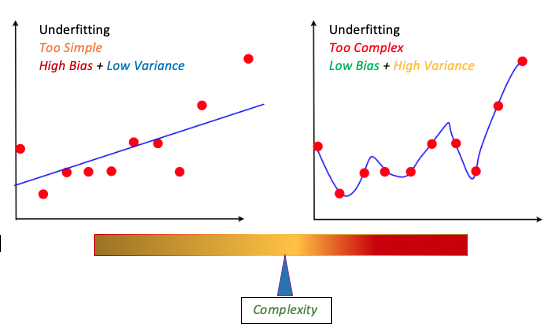

# Error Analysis in Machine Learning

## Optimization and Generalization

One of the fundamental issue in machine learning is the balance between optimization and generalization. *Optimization* refers to the process of adjusting a model to get the best performance possible on the training data, while *Generalization* refers to how well the trained model performs on data it has never seen before. The ultimate goal of a learning system is to come up with a good generalization.

While training a model at first, the optimization and generalization are correlated; i.e., the lower the loss on training data, the lower the loss on the test data. As the process continues, the model is said to be __underfit__ meaning there is still progress to be made and the model has not yet learned all relevant patterns in the training data. But, after certain number of iterations over the training data, `generalization` stops improving and validation metrics gets halted and then begin to degrade, which means the model is starting to __overfit__ indicating that it's starting to learn patterns which are specific to the training data but which are misleading or irrelevant when it comes to new data.

## Overfitting and Underfitting

*Overfitting* and *Underfitting* are common problems in machine learning. They are a direct outcome of the model's generalization and are a phenomenon which occurs when the learned model fails to perform well on the new or real data.

- Overfitting

__Overfitting__ is quite a common problem where a model performs well on the training data but does not generalize well to unseen (test or new) data. If a model suffers from overfitting, the model will have high Variance, which can be caused by having too many parameters leading to a rather too complex model.

- Underfitting

A model can suffer from __Underfitting__ when the model is not complex enough to capture the pattern in the training data well and therefore cannot perform well on unseen data.

The below figure provides an idea of how the data fits on a model for some random data set.

We may discuss more about the *overfitting* and *underfitting* using curve fitting depicted in the above figure.

Consider plotting a best fitting curve given a set of points. One might think that the best fitting curve is the one that passes through and touches each and every point given. But such a curve lacks smoothness and will not be able to pass through a new point using the pattern followed earlier, because it's too difficult to extrapolate and find an unknown value based on the point's it crossed previously because of the random or haphazard path it followed while covering each and every point available. The extreme right plot shown in the figure above covers this case and it's a classic case of `Overfitting` or `High Variance`.

It's a very common case in machine learning, neural and deep learning systems. Overfitting happens when our model tries so hard to correctly classify each and every sample, that it ends up modeling of all of these tiny noises and intricacies for each input; and when we give it a new data it hasn't seen during training, the model does not know what to do! In other words, we may say the model generalizes poorly. Ideally we would like our model to generalize to new and unseen data. So, if it overfits the accuracy is compromised on new data.

Overfitting may also be attributed to size of the model, where the problem is huge and considerable number of parameters are involved in the prediction algorithm. Usually if the number of parameters are mode, it will increase the accuracy of the model. Using an `(N - 1)` degree of polynomial, we can perfectly cover `N` number of points.

### *Overfitting* and *Underfitting* continued

- __Overfitting__

As stated earlier, `overfitting` is a phenomenon which occurs when a model learns the detail(s) and noise in the training data to such an extent that it negatively impacts the performance of the model on new data. It happens when the model is very good at learning its training set, but cannot generalize beyond the training set (known as the generalization problem).

- *Detecting `overfitting`*

  - Ways to detect overfitting.

    - If the error (or loss) for the training data as well as the error for the validation data are plotted and it has been observed that the training loss is very small, but the validation loss is high, then it's an indication of `overfitting`. This indicates that the model is really performing well over the training data, but is failing to generalize.

    - If the training set accuracy is very high for the model and the test set accuracy is very low, then again it's an indication of `overfitting`, as the model is not generalizing well.

- __Underfitting__

`Underfitting` is the inverse or reciprocal of `Overfitting`. This is not so much a common problem in machine learning as overfitting, but it does help in the model selection. It happens when the model is not able to generate accurate predictions on the training set (or validation set).

While trying to reduce overfitting, we might actually begin to head to the other extreme and our model can start to ignore important features of our data set. This happens when we choose a model that is not complex enough to capture these important features, such as using a linear model when a quadratic is necessary.

Often it's represented with an excessively smooth curve passing through the data points as can be seen from the extreme left of the picture depicting the curves. In the figure, the line is linear even though the underlying data is not linear. This kind of extreme generalization can also lead to poor accuracy.

- *Detecting `underfitting`*

  - Ways to detect underfitting.

    - If after analyzing the training and validation loss, it has been observed that both are high, then it's an indication that the model is `underfitting`.
    In order to prevent underfitting, we may use a larger model. In case of a neural network model, we can try to increase the number of hidden neurons or try putting in more hidden layers. These will increase the number of parameters of the model and prevent underfitting.

- Symptoms

| Overfitting | Underfitting |
| :---        | :---         |
| - [x] *Low Bias* | - [x] *High Bias* |
| Accurate prediction for training set | Poor prediction for training set |
| - [x] *High Variance* | - [x] *Low Variance* |
| Poor ability to generate predictions for validation set | Poor predictions for validatio set |

### An example on Overfitting

Assume for instance that we are working on a model to predict Earthquake occurrence from a data set consisting of the frequencies of earthquakes occurred in the past and their effects.

Next, we check the model out in the real world to get a prediction on the probability of a very strong earthquake from the real-time seismic frequencies. If the model is able to predict with `99%` accuracy, then it's just a *WoW* factor.

But what if it happens that the model's prediction is under `50%`? This is a clear indication that the model worked well on the training data, but failed to perform well over the unseen data; __A clear case of Overfitting__.

That's a terrible disaster if such a critical model fails in the real world. In fact the above example is a real case of devastating effect of overfitting which happened in the case of **Fukushima Power Plant**. The safety plan for _Fukushima Daiichi Nuclear Power Plant_ was designed using historical data of the past 400 years. The engineers designed the plant to withstand an earthquake of intensity `8.6` on **Richter** scale and a Tsunami as high as `5.7` meters. The threshold numbers quoted were finalized using predictive modeling by analyzing the earthquake data (intensity and annual frequency) of the past 400 years and a prediction model was built using the same in order to help predict the future earthquakes.

The standard method of determining earthquake is by using [Gutenburg-Richter model](https://en.wikipedia.org/wiki/Gutenberg%E2%80%93Richter_law) which fits the data on a straight line (using linear regression). The model showed that an earthquake of intensity `9.0` is likely to occur in `150` years.

However, during the design of the _Fukushima Daiichi Power Plant_, the engineers and scientists used a **curve** instead of a **straight line** as their prediction model. With this model, an earthquake of intensity `9.0` was `70` times less likely to occur. But on __March 11, 2011__, the `Fukushima power plant` was hit by an earthquake of intensity `9.1` and a tsunami of height __greater than `14` meters__ resulting in one of the biggest nuclear disasters ever.

The whole episode was the result of improper understanding of _**Overfitting** or **High Variance**_ problem in supervised machine learning.

Much of the information quoted here, about the *Fukushima Daiichi Nuclear Power Plant* was taken from the brilliant paper [Fukushima: The Failure of Predictive Models](https://mpra.ub.uni-muenchen.de/69383/1/MPRA_paper_69383.pdf) - <cite>Brian Stacey</cite>

## Bias versus Variance

There are two common categories of error(s) in the world of machine intelligence, the training error and the validation error. These two can come up from the data set distributed as training and validation(test) data set(s).

Training error is the difference between the known correct output for the inputs and the actual output of the prediction model. During the course of training the training error is reduced until the model produces an accurate (or a near accurate) prediction for the training set.

Validation error is the difference between the known correct output for the validation set and the actual output of the prediction model.

The errors in the prediction can be decomposed into two main sub-components:

- Error due to __Bias__
- Error due to __Variance__

Bias and Variance are two statistical concepts which are important for almost all types of machine learning algorithms

- Bias:

Bias can be considered as an error from erroneous assumption in the learning algorithm or model. High *Bias* means the model is not *fitting* well on the training set. This means the training error will be large. Low *Bias* means that the model is fitting well, and the training error will be low.

- Variance:

Variance is the amount that the estimate of the target function will change if different training data was used.High *Variance* means that the model is not able to make accurate predictions on the test or validation set and the validation error will be large. Low *Variance* means the model is successful in breaking out of it's training data.

__High Bias is equivalent to aiming at the wrong place, while High Variance is equivalent to aiming an unsteady target__

Here is an illustration of the Bias vs Variance using the analogy of archery.

### Bias versus Variance trade-off

Every model has both bias and variance error components along with some noise. **Bias** and **Variance** are inversely related to each other, while trying to reduce one component, the other component of the model will increase. One needs to balance both in order to create a good fit. The ideal model will have both __low bias__ and __low variance__.

Often it happens that in order to avoid overfitting, we may start running into underfitting, ignoring the important features in training data. So, a right balance between the two is much needed which is the same as balance between bias and variance.

The problem of balancing both Bias and Variance is what is called as Bias-Variance trade-off or dilemna. Both bias and variance are just the side effects of the complexity of our model. In case of high bias, our model was too simple and in case of high variance our model was too complex. So, complexity is what is the factor bridging both.

The above image clear why there is a trade-off between bias and variance. Whenever a simple model (low complexity) is chosen, we are also choosing a model with high bias. If we try to increase the complexity of the model, we are sacrificing low variance in exchange for low bias at the cost of high variance. The best thing which can be done is to settle somewhere in between the two in order to balance both.

## Regularization

_Regularization_ is a technique which is used to solve the overfitting problem of the machine learning models.

## References

- [Fukushima disaster was preventable, new study finds][L1]

- [Fukushima: The Failure of Predictive Models][L2]

[L1]: <https://news.usc.edu/86362/fukushima-disaster-was-preventable-new-study-finds/>
[L2]: <https://mpra.ub.uni-muenchen.de/69383/1/MPRA_paper_69383.pdf>
