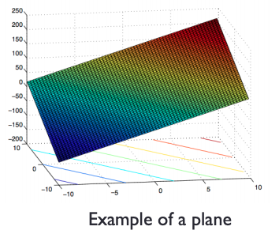
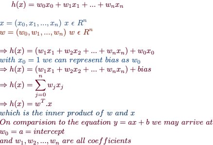
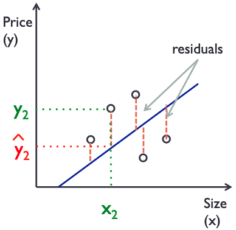

# General concepts about Linear Regression

In it's simplest forms, Machine learning involves training of known data
inorder to predict the outcome over unseen data. This concept is called as
`Supervised Learning`. There are other forms available like unsupervised
learning, clustering etc.,

Linear Regression falls under the class of Supervised Learning as we are using
the past data to predict the futuer events or outcomes.


## Univariate Linear Regression

This is the linear regression technique using only one feature.

Let's say we are tasked with the objective of estimating the price of a new 25𝑚² house based on the previous historical data containing the price and area in square meters. If we plot the `price` vs `area` we would get the following similar graph.

!(linear plot)[images/plot.png "linear regression plot"]

This is a linear plot governed by the equation, `𝑦 = 𝑎x + 𝑏`

where, 𝑎 = coefficient (the slope of line)
           𝑏 = intercept (off set of line)

From this, we can get the estimated price using the equation `y₂₅ = 𝑎.25 + 𝑏`

## Multivariate Linear Regression

In general, linear regression with many features is represented by the following equation

```
h(𝑥) = w₁x₁ + w₂x₂ + ... + wₙxₙ + b
```

Here, `h(x)` is called as a **Hypothesis**  and is referred differently based on the number of features as below

* Is called a *line* for one feature.

* Is called a *plane* for two features and

* Is called a *hyperplane* for more than two features (shown in the below figure)



The `hypothesis` can be represented mathematically as below:



## Cost function

The cost function calculates the error in the model. The goal of a machine
learning algorithm would be to minimize the error, for which various method
are available. One such methods involves minimizing the sum of the squares of
the distance of the real values from the estimated values over the training
data as represented in the below figure.




### Cost function using Ordinary Least Squares

- Using the Residual Sum of Squares (`RSS`)

Cost function is usually denoted as `J(w)`

It's usually represented as


The goal would be to find the weights (w₀, w₁, ...,wₙ) such that J(w) is
minimized. This is achieved using the [Gradient Descent](https://github.com/fpdevil/rise_of_machines/blob/master/GradientDescent.md), which is described seperately.

### Pros and Cons of Ordinary Least Squares method

- Pros:
    - Does not have parameters to tune.
    - It performs well on larger data sets.
    - The algorithm is simple to understand.

- Cons:
    - It's performance is poor over smaller data sets with less number of features.
    - On big datasets it may become slow.
    - The complexity of the model will increase with the increase in number of
       features.
    - It has a risk of Overfitting and/or Underfitting.
