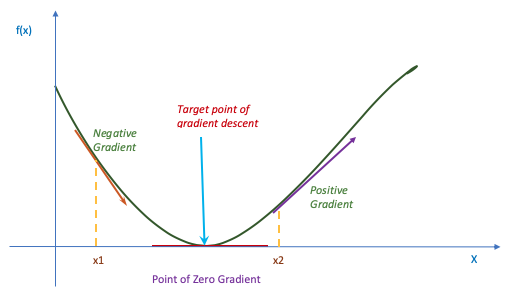
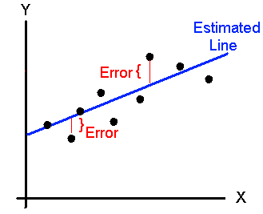
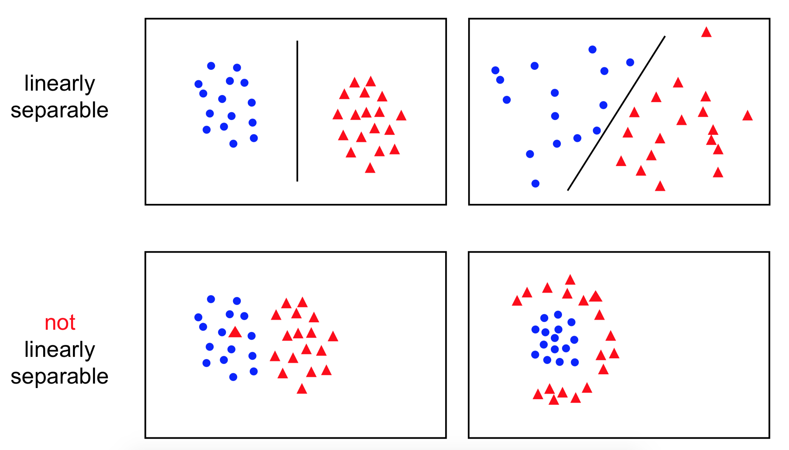

# Linear Regression & Gradient Descent

## What is `Gradient Descent` ?

`Gradient Descent` is a first-order iterative optimization algorithm for finding the minimum of a function. More specifically, it is an optimization algorithm used to minimize some cost or an error function by iteratively moving in the direction of steepest descent as defined by the negative of the gradient. In machine learning, we use gradient descent to update the parameters of our model during linear regression. The parameters here refer to coefficients in linear regression and/or weights in a `Neural Network`.

> `Gradient Descent` when applied to `Neural Networks` is called as `Back Propogation`

In `geometrical terms`, a gradient can be best understood as the slope, the tangent line, or the direction to move to (up or down) in order to minimize the error. Gradient is the slope of the curve, and Descent as the name implies is the action of moving down. So, Gradient Descent is the process of going down the slope of the given curve to reach its mining.

To understand in a simpler way,consider the example of a blind folded person at the top of a hill, and trying to reach a lake which is at the lowest point of the hill.  So, what approach will he take to reach the lake?

The best way for him is to check the ground near to him and observe where the land tends to descend. This will give an idea in which direction he should take his first step. If the descending path is followed, it is very likely that he would reach the lake. Obviously, the person needs to follow several such smaller steps before he reaches his destination.

## Learning Rate and Optimization
The size of the steps followed to reach to the bottom is what is called as `Learning Rate`.  The learning rate specifies how aggressively the optimisation technique should jump between each iteration.

- If the *learning rate* is too large, we can cover more ground each step but we risk overshooting the lowest point since the slope of the hill is constantly changing. The optimisation in such cases may be unstable (bouncing around the optimum, and maybe even getting worse rather than better).

- If the *learning rate* is too small, we can confidently move in the direction of the negative gradient since we are recalculating it quite frequently. A low *learning rate* is more precise, but calculating the gradient is time-consuming (taking a long time and potentially never reaching the optimum), so it will take us a very long time to get to the bottom.

## Error or Cost Function and Parameter optimization

A `Cost Function` provides an idea about how good is our model in making a prediction for a given set of parameters. The *Cost function* has it's own curve and it's own gradients. The slope of this curve tells us how to change our parameters to make the model more accurate! We can use the model to make predictions and use the cost function to update our parameters. Our cost function can take a variety of forms as there are many different cost functions available. Popular cost functions include: *Mean Squared Error*, *Root Mean Squared Error*, *Least Squared Error* etc.,

>For prediction problems like the one governed by *Linear regression*, the associated error surfaces have 2 properties, which help us find the optimal combination of weights.
> They are `Convex` and they have a `global minimum`. By convex, we mean that the error surfaces are shaped like a bowl. Having a global minimum means that on an error surface there is a unique set of optimal weights with the lowest sum of squared errors. The reason that the error surface always have such properties is that it's overall shape is determined by the linearity of the model rather than the properties of the data. If we can find the global minimum of the error surface, we can find the set of weights defining the model that best fits the training dataset. This approach of finding weights is known as `Least Squares Optimization`.

The method of least squares is the most popular method used to calculate the coefficients of the regression line. The goal of the regression line is to find the line that best describes the linear pattern observed on the scatter plot. The least squares method is the method that minimizes the error terms which are the difference between the observed values of y ( ![e1] ) and the predicted values of y ( ![e2] ). Such a linear model can be depicted using the below figure:

Consider the example of linear regression where our model is f(x) = mx + c, where m and c are the parameters we can tweak.

y = mx + c

### Formula for the `Mean Squared Error`

MSE = ![e3]

This would be the cost function or the error function and can usually be represented as ![e4]

where

- N = total number of observations (data points)

- ![e5] is the mean

- ![e1] is the actual value of an observation and ![e6] is our prediction

Because we can expect the error surface to be convex and possess a global minimum, we can find the optimal weights at the point where the *partial derivative* of the error surface with respect to `m` and `c` are equal to `0`.

> Given the cost function ![e7]
> The gradient of the `Cost function` would be
> ![e8]
> ![e9]

## Applications of `Gradient Descent` for `Linear Regression`

Linear Regression is one of the most fundamental algorithms in the Machine Learning arena. It's a supervised machine learning algorithm where the predicted output is Continuous and has a constant slope. It's used to predict values within a continuous range. (e.g.  price, height etc.,) rather than trying to classify them into categories (e.g. cat, dog, chipmunk) which only have Discrete data.

### Simple `Linear Regression`.

Linear Regression is based on an extremely simple premise that we may fit a straight line between our target (dependent variable) and feature (independent variables). It is a parametric model as it makes assumptions about the data. We are assuming that the dependent variable is a linear combination of independent variables.

So, essentially, `Linear Regression` is

- 1 A supervised machine learning algorithm which learns from given `x` dependent variable and `Y` as quantifiable variable and predicts New `Y` from given new `X`.
- 2 It works in a way such that it finds the best fitting line from the given data.

Clearly stated, the goal of linear regression is to fit a line through a set of points.

Such a simple linear regression uses traditional slope-intercept form, governed by the equation `y = mx + c`where `m` and `c` are the variables our algorithm will try to "learn" to produce the most accurate predictions. `x` represents our input data and `y` represents our prediction.

Below is a pictorial representation of such a simple linear regression.

In order to find the best fitting line for our data, we need to find the best set of slope `m` and y-intercept `c` values. This often involves a set of trial and errors as well as iterations using multiple updated values of both `m` and `c` until we land on an equation with values which will not change any further. Because, there is a trial and error as well iterations involved, there is always a certain percentage of error which would control the degree of correctness of the values `m` and `c`. How good the values can be estimated and predicated depends on the error value which is quite volatile and it's clear that the lower such error value the more correct the values and the equation. This is where `Gradient Descent` plays an important rule of correcting/reducing the error to a near zero value.

## Learning Rate ($$\eta$$)

The Learning Rate variable $$\eta$$ controls how large of a step we take downhill during each iteration. If we take too large of a step, we may step over the minimum. However, if we take small steps, it will require many iterations to arrive at the minimum.

## Convergence for Perceptron

Convergence is one of the biggest problems of `Perceptron` and the *Perceptron Learning Rule* will converge only if the two classes are linearly separable. Simply said, if we are able to draw a straight line to entirely separate the two classes of data, the algorithm will converge. Else, the algorithm will keep iterating and will readjust weights forever or until it reaches the maximum number of iterations or  epochs which needs to be supplied manually.

Here is a figure depicting what is meant by Linearly seperable and non-seperable data points:

### References
* [Machine Learning Lectures] - C19 Machine Learning lectures By Andrew Zisserman
* [UCI Machine Learning Repository] - Vast data sets for playing with ML Algorithms

[Machine Learning Lectures]: <http://www.robots.ox.ac.uk/~az/lectures/ml/index.html>
[UCI Machine Learning Repository]: <http://archive.ics.uci.edu/ml/datasets.html>

[e1]: http://www.sciweavers.org/tex2img.php?eq=y_i&bc=White&fc=Black&im=jpg&fs=12&ff=arev&edit=0
[e2]: http://www.sciweavers.org/tex2img.php?eq=%5Cwidehat%7By_i%7D&bc=White&fc=Black&im=jpg&fs=12&ff=arev&edit=0
[e3]: https://latex.codecogs.com/gif.latex?%5Cinline%20f%28m%2Cc%29%3D%5Cfrac%7B1%7D%7BN%7D%5Csum_%7Bi%3D1%7D%5E%7BN%7D%28y_i%20-%20%28mx_i%20&plus;%20b%29%29%5E2
[e4]: http://www.sciweavers.org/tex2img.php?eq=Error%28m%2C%20c%29%3D%5Cfrac%7B1%7D%7BN%7D%5Csum_%7Bi%3D1%7D%5E%7BN%7D%20%28y_i%20-%20%28mx_i%20%2B%20b%29%29%5E2&bc=White&fc=Black&im=jpg&fs=12&ff=arev&edit=0
[e5]: http://www.sciweavers.org/tex2img.php?eq=%5Cfrac%7B1%7D%7BN%7D%5Csum_%7Bi%3D1%7D%5E%7BN%7D&bc=White&fc=Black&im=jpg&fs=12&ff=arev&edit=0
[e6]: http://www.sciweavers.org/tex2img.php?eq=%28mx_i%20%2B%20c%29&bc=White&fc=Black&im=jpg&fs=12&ff=arev&edit=0
[e7]: http://www.sciweavers.org/tex2img.php?eq=f%28m%2C%20c%29%3D%5Cfrac%7B1%7D%7BN%7D%5Csum_%7Bi%3D1%7D%5E%7BN%7D%20%28y_i%20-%20%28mx_i%20%2B%20b%29%29%5E2&bc=White&fc=Black&im=jpg&fs=12&ff=arev&edit=0
[e8]: http://www.sciweavers.org/tex2img.php?eq=%5Cfrac%7B%5Cpartial%20f%7D%7B%5Cpartial%20m%7D%20%3D%20%20%5Cfrac%7B1%7D%7BN%7D%5Csum_%7Bi%3D1%7D%5E%7BN%7D%20-2x_i%28y_i%20-%20%28mx_i%20%2B%20b%29%29&bc=White&fc=Black&im=jpg&fs=12&ff=arev&edit=0
[e9]: http://www.sciweavers.org/tex2img.php?eq=%5Cfrac%7B%5Cpartial%20f%7D%7B%5Cpartial%20m%7D%20%3D%20%20%5Cfrac%7B1%7D%7BN%7D%5Csum_%7Bi%3D1%7D%5E%7BN%7D%20-2%28y_i%20-%20%28mx_i%20%2B%20b%29%29&bc=White&fc=Black&im=jpg&fs=12&ff=arev&edit=0
