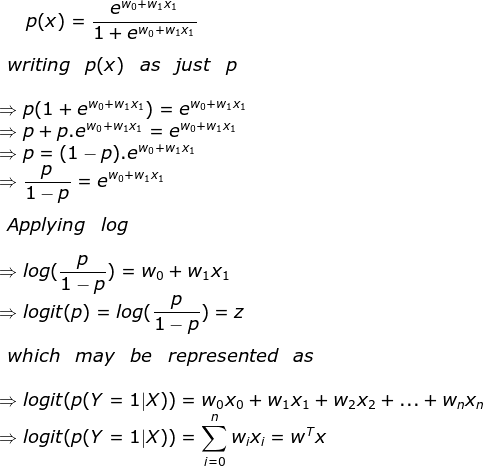
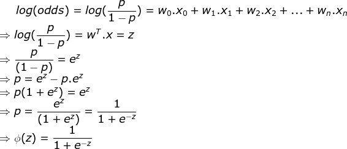
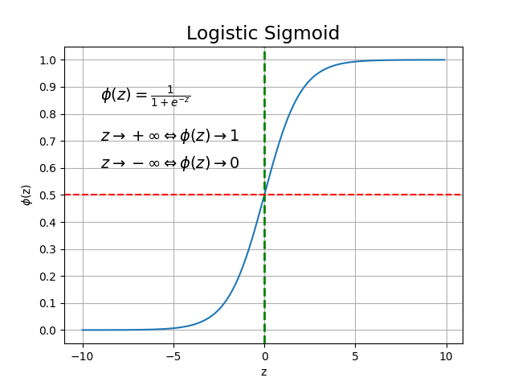
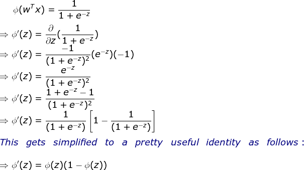
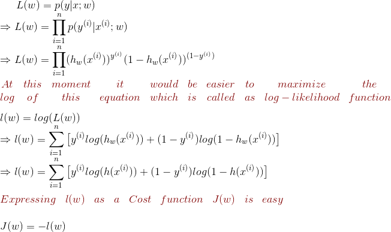

# Logistic Regression in Machine Learning

Logistic Regression (sometimes called as Logistic model or Logit model) is a multivariable method for analyzing the relationship between multiple independent variables and a categorical dependent variable. Here multivariate or multivariable analysis refers to the prediction of a single outcome using multiple variables.

Logistic Regression belongs to the family of Generalized Linear Models (`glm`), and it's a binary classification algorithm used when the response variable is dichotomous (either 0 or 1). It is the most scalable learning algorithms.

## Types of Data

Traditionally data can be either of the below

### Qualitative vs. Quantitative

- Quantitative Data: It provides numerical information (numbers) or information about quantities; that is, information that can be measured and written down with numbers.
  Examples are: height, size, length, weight etc.

- Qualitative Data: It provides descriptive information (describing something) about qualities; information that can't actually be measured.
  Examples are: Eye Color, Gender etc.

Here are examples covering some differences

- Number of people attended to a party. (Quantitative.)

- The softness of a cat. (Qualitative.)

- The color of the sky. (Qualitative.)

- The number of pennies in your pocket. (Quantitative.)

### Discrete vs. Continuous

`Quantitative data` can further be classified as `Descrete or Continuous` which are as described below:

- Discrete Data which can only take certain values (like whole numbers)
- Continuous Data which can take any value (within a range)

> In short, If a variable can take on any value between its minimum value and its maximum value, it is called a continuous variable; otherwise, it is called a discrete variable.


### Univariate vs. Bivariate Data

Statistical data are often classified according to the number of variables being studied.

- Univariate Data:

When we conduct a study that looks at only one variable, we say that we are working with univariate data. Suppose, for example, that we conducted a survey to estimate the average weight of high school students. Since we are only working with one variable (weight), we would be working with univariate data.

- Bivariate Data:

When we conduct a study that examines the relationship between two variables, we are working with bivariate data. Suppose we conducted a study to see if there were a relationship between the height and weight of high school students. Since we are working with two variables (height and weight), we would be working with bivariate data.


## Dependent and Independent Variables

In world of learning, there are two entities.
- Input and
- Output

The output of the learning is based on the input, and hence `output` is coined as a dependent variable and `input` as an independent variable. Consider for example a task of predicting the `Mileage of a Car` based on the parameters like `Make of Car`, `Year of Manufacturing` and `Engine Capacity`.

The input variables are typically denoted using the symbol X, with a subscript to distinguish them. So, 𝑋₁ might be the `Make of Car`, 𝑋₂ might be `Year of manifacturing` and 𝑋₃ might be `Engine Capacity`. The output variables are denoted by the symbol Y.

The input variables may also be known with other names like `predictors`, `independent variables`, `features` or sometimes as just `variables`.
The output variables may also be known as `response` or `dependent` variables.

With the above example of Car, we can write an equation representing some kind of relation between the car mileage (Y) and the input parameters as below.

`Y = 𝑤₀𝑋₀ + 𝑤₁𝑋₁ + 𝑤₂𝑋₂ + 𝑤₃𝑋₃`

`𝑤₀` refers to the bias unit, and is an additional input value that we provide
    for `𝑋₀ = 1`

With that, the equation becomes `Y = bias + 𝑤₁𝑋₁ + 𝑤₂𝑋₂ + 𝑤₃𝑋₃`

or `Y = f(X) + ϵ`       (where `ϵ` is the error term)

where `bias` is the error term
       the coefficients 𝑤₁, 𝑤₂ and 𝑤₃ are the coefficients of independent variables,
       obtained as the best mathematical fit of specified model or equation.

A coefficient indicates the impact of each independent variable on the outcome variable adjusting for all other independent variables. The model serves two purposes.

  1. It can predict the value of dependent variable for new values of independent variables
  2. It can help describe the relative contribution of each independent variable to dependent variable,
     controlling for the influences of the other independent variable.

## Logistic Regression

`Logistic Regression` also known as `Logit model` or `Logistic model` analyzes the relationship between multiple independent variables and a categorical dependent variable, and estimates the probability of occurrence of an event by fitting data to a Logistic curve.

There are two models within logistic regression as listed below:

  1. Binary Logistic Regression &
  2. Multinomial Logistic Regression

`Binary Logistic Regression` would be typically useful when the dependent variable is dichotomous (can fall into 2 categories like Head & Tail; Pass or Fail; 0 or 1 etc.) and the independent variables are either Continuous or Categorical.
When the dependent variable is not dichotomous and is comprised of more than 2 categories, a `Multinomial Logistic Regression` may be used.

Despite the name being `Logistic Regression`, it's used in the classification category to predict the discrete output. It's mostly used as a binary class classifier and the binary logistic model is used to estimate the probability of a binary response and it generates the response based on one or more predictors or independent vaiables or features.

Logistic Regression assumes that the dependent (response variable) follows a Binomial distribution which can have the following characteristics

1. The number of trials are fixed, say `n` i.e., the number of rows in the data set must be a fixed number.

2. Every trial can only have two outcomes, which means that the response variable (`y`) can only have two unique categories.

3. The outcome from each trial must be independent of each other. In other words, the response variable"s levels must be independent of each other.

4. The probability of success `p` and the failure `q` (1 - p) must be the same for any trial.

## Sigmoid function

The Logistic Regression algorithm employs a `Logistic function` or `Sigmoid function`. The `Sigmoid function` is used as a hypothesis function which the machine will use to classify the data and predict labels or the target variables. Here the target variables can be either `0` or `1` as the model is probabilistic and probabilities always lie between `0` and `1`.

So, mathematically if `y` is the output label then y ∈ [0, 1]

The hypothesis function can convert the output value to either zero or one and the `sigmoid` exactly does that.

The mathematical equation of `Logistic` or `Sigmoid` function is as shown below

![e1]

where `z` is the weighted sum defined as under


Here `𝑃(𝑌 = 1 | 𝑋)` is read as the probability of `Y = 1` given some value of `X` and `𝑌 ∈ [0, 1]`
It may also be written as `g(z) = 𝑃(𝑌 = 1 | 𝑋; 𝑤)` in which case it's defined as the probability of a particular sample belonging to class 1, given it's features x parameterized by the weights `w`.

In order to find the link function, we can use algebraic calculus and proceed as below.

Assuming `𝑃(𝑌 = 1 | 𝑋)` as just `𝑝(𝑋)`



Here, `𝑃(𝑌 = 1 | 𝑋)` is the conditional probability that a particular sample belongs to class 1 given it's features `𝑋`.

From the above equation of `logit`, it can be inferred that the right side is a linear combination of independent variables. The left side is known as the __log - odds__ or __odds ratio__ or __logit__ function and is the `link` function for Logistic Regression.

So, Logistic Regression applies maximum likelihood estimation after transforming the dependent variable into a `logit` variable (a natural log of odds of the dependent variable occurring or not) with respect to independent variables. In the following equation, `log` of odds changes linearly as a function of explanatory variables.


This may further be taken forward to achieve at the sigmoid as below.



We are interested in predicting the probability that a certain sample belongs to a particular class, which is the inverse form of the `logit` function. It is also called the `Logistic Sigmoid function`, which is abbreviated sometimes as simply `sigmoid` due to it's characteristic __S-Shape__. A plot of the sample `sigmoid` is included during the next section.

*We may argue, why odds, `log(odds)` and not `probability`? The reason is as follows:*

```python
ProbabilityRange = [0, 1]

OddsRange = [0, +∞] as Odds = Probability / (1 - Probability)

logRange(odds) = [-∞, +∞]
```

By converting the probability to `log(odds)`, the range of probability is expanded from `[0, 1]` to `[-∞, +∞]`. In other words, applying log reduces the potential for numerical underflow, which can occur during small likelihoods, which is the reason why _natural log_ is applied to the _likelihood_ function later.

This `link` function or `logit` follows a sigmoid as shown next which limits the range of probabilities between `0` and `1`.

In `python` such an equation may be coded and visualized as below.

```python
import math

import numpy as np
import matplotlib.pyplot as plt


def sigmoid(z):
    a = []
    for x in z:
        a.append(1.0 / (1.0 + math.exp(-x)))
    return a


x = np.arange(-10., 10., 0.1)
s = sigmoid(x)
plt.plot(x, s)
plt.xlim()
plt.ylim(-0.1, 1.1)
plt.xlabel('z')
plt.ylabel('g(z)')

plt.xticks()
plt.yticks([0.0, 0.5, 1.0])
ax = plt.gca()
ax.yaxis.grid(True)

plt.title('Sigmoid function')
plt.text(-7.5, 0.85, r'$g(z) = \frac{1}{1 + e^{-z}}$')
plt.text(-7.5, 0.70, r'$z \rightarrow  \infty  ; g(z) \rightarrow 1$')
plt.text(-7.5, 0.65, r'$z \rightarrow  -\infty  ; g(z) \rightarrow 0$')

plt.show()
```

The above code provides the below plot



From the above figure, the below can be inferred

- If the value of `z` is greater than or equal to zero, then the logistic function gives an output value of one

- If the value of `z` is less than zero, then the logistic function generates the output zero.

So, we may conclude that the `Sigmoid` takes real number values as input and transforms them into values in the range `[0, 1]` with an intercept at `g(z) = 0.5`

Such inferences can be represented mathematically as follows:

![e2]

This would be the function which may be used for performing the Binary classification.

Representation of the `Sigmoid` function using `Hypothesis` function:

![e3]

Substitute the value of `z` with ![e4] in the preceding equation, then the equation ![e1] is converted to the following

![e5]


### A useful property of the derivative of the Sigmoid function.

Differentiating the `hypothesis` and the `sigmoid`, we can observe the below and arrive at a very useful property



This is an interesting and a useful property of derivative of sigmoid function.

### Parameter estimation (Given a Logistic Regression model, how do we fit weight 𝑤 for it?)

The goal of the Logistic Regression is to find or estimate the unknown parameters `𝑤 (w₀, w₁, w₂ ... wₙ)` which is done by  using the __`Maximum Likehood Estimation`__ which entails finding the set of parameters for which the _Probability_ of the observed data is greatest. The `Maximum Likelihood` works in such way that it tries to find the value of the coefficients (just 𝑤₀ & 𝑤₁ OR 𝑤₀, 𝑤₁, 𝑤₂...) such that the predicted probabilities are as close to the observed probabilities as possible.

In other words, for a binary classification [0, 1], the maximum likelihood will try to find the values of coefficients 𝑤₀ and 𝑤₁ (OR 𝑤₀, 𝑤₁, 𝑤₂ ...) such that the resultant probabilities are closest to either `0` or `1`.

- __Bernoulli Distribution__

Because we are discussing about the discrete variables, at this point it"s worth  discussing about the __Bernoulli Distribution__ regarding the discrete random probability. `Bernoulli Distribution` is the probability distribution of a random variable taking on only two values as below

- `1` (`success` or `true`) and
- `0` (`failure` or `false`)

with complementary probabilities `p` and `q` respectively.

Where `p` and `q` are related to each other as `p + q = 1` or `q = 1 - p`.

> Any random variable whose only two possible values are `0` and `1` is called a `Bernoulli random variable`.

Mathematically,  `Bernoulli Distribution` is the probability distribution of random variable *X* having the `probability mass function` defined as below:

- If a random variable __X__ takes two values `0` and `1`, with probabilities `p` and `1 - p`. Then its `Probability Mass function` is depicted as below:

![e13]

Also, from the sigmoid function plot we can interpret that it's similar to the following:

![p2]

where `ŷ` is the predicted probability converted to a binary outcome via a threshold function `g(𝑧)`.

- __Frequency__ function which is the closed form of a probability mass function is written as

![e14]


#### finding the coefficients

As discussed earlier, the goal here is to find the coefficient(s) `𝑤` for the best fitting model which best explains the training data set, by using the `Maximum Likelihood Estimator` under a set of assumptions. Let us endow our classification model with a set of probabilistic assumptions and then fit the parameters via *maximum likelihood*.

_Below are the probabilistic assumptions we considered:_

*__Note__: These assumptions follow the `Bernoulli distribution` discussed earlier*

- Assumption 1

  Probability of a particular sample belonging to class `1`, given it's features `x` parameterized by the weights `w` defined as under:

![e11]

- Assumption 2

  Probability of a particular sample belonging to class `0`, given it's features `x`  parameterized by the weights `w` defined as under:

![e12]

The `Maximum Likelihood equation` is derived from the probability distribution of the independent variable (`𝑥`) and dependent variable ('𝑦').

With these, we can express the assumptions made earlier in a more compact form as under:

![e15]

Then the likelihood of the weight parameter `𝑤` may be written as:

`L(𝑤) = P(y|x; 𝑤)`

This is read as the probability of a sample belonging to class `y` given its features `x` parameterized by the weight `𝑤`.

Assuming that __n__ training samples were generated independently, the likelihood function for the coefficients 𝑤₀, 𝑤₁... may be written as under:





In mathematics, the `Negative Log Likelihood` function is also known as `Error Function` or `Cost Function`.

Once we have an __Error or Cost function__ in our hand, we can apply an optimization algorithm such as __gradient descent__ to __minimize__ the cost function; otherwise, we may apply __gradient ascent__ to maximize the log-likelihood function.

With that, the __Cost or Error function__ may be represented as under:

![p3]

- __Single Sample Training Instance__

In order to get a clear understanding of the `cost function` defined above, let us take a look at the `cost` that may be calculated for one single-sample training instance as under:


### The next section illustrates the cost of classifying this single-sample training instance for different values of _g(z)_ using python

Here is a plot of __g(z)__ against cost function __J(w)__ using python, which
shows the _sigmoid_ activation on the __x-axis__ within range `0` through `1`
and the associated logistic cost over __y-axis__. The input values to
`sigmoid`, _z_ is in the range of [-10, 10].


```python
import numpy as np
import matplotlib.pyplot as plt

def sigmoid(z):
    return 1.0 / (1.0 + np.exp(-z))

def cost_y_1(z):
    return -np.log(sigmoid(z))

def cost_y_2(z):
    return -np.log(1 - sigmoid(z))

# plotting the error/cost function
z = np.arange(-10, 10, 0.1)
g_z = sigmoid(z)
c1 = [cost_y_1(x) for x in z]
plt.plot(g_z, c1, label='Cost function J(w) for y = 1')
c0 = [cost_y_2(x) for x in z]
plt.plot(g_z, c0, linestyle='-.', label='Cost function J(w) for y = 0')
plt.xlim([0, 1])
plt.ylim([0.0, 5.1])
plt.xlabel('g(z)')
plt.ylabel('J(w)')
plt.legend(loc='best')
plt.show()

```


From the above figure it can be inferred that the cost reaches `0` if the
prediction is correct for the sample belonging to either `class 1` or `class
0`; but if the prediction is wrong, then the cost shoots up towards __infinity__
on both cases, which indicates that the wrong predictions are penalized with
an increasingly larger cost.

## Evaluation metrics in Logistic Regression

In linear regression, the adjusted statistical terms or metrics are checked in order to evaluate the performance or model fit and accuracy. Following are the evaluation metrics used for Logistic Regression.

__1. Akaike Information Critera (`AIC`)__

Akaike information criterion (AIC) (Akaike, 1974) is a fined technique based on in-sample fit to estimate the likelihood of a model to predict/estimate the future values. It measures the relative quality of a statistical model for a given set of data.

Akaike’s information criterion (AIC) compares the quality of a set of statistical models to each other. For instance, you might be interested in finding which variables contribute to low economical status and how the variables contribute to that status. Let’s say you create several regression models for various factors like education, finance, family size, or disability status. The `AIC` will take each model and rank them from best to worst. The *best* model will be the one that neither _under-fits_ nor _over-fits_.

Although the `AIC` will choose the best model from a set, it won’t say anything about the absolute quality. In other words, if all of your models are poor, it will choose the best from the available bunch which might all be bad. Therefore, once you have selected the best model, consider running a hypothesis test for figuring out the relationship between the variable's in your model and the outcome of interest.

A lower value of the `AIC` indicates a better fit.

The following equation is used to estimate `AIC`

`AIC = -2*ln(L) + 2*k`

where
    _L = Maximum value of Likelihood which is a measure of model fit (higher
    the better fit)_ and
    _k = Number of variables in the model_

For smaller sample sizes `(n/K <= 40)`, use the second order `AIC` as follows

`AIC = -2*ln(L) + 2*k + (2*k(k+1)/(n-k-1))`

where
    _n = Sample size_,
    _L = Maximum likelihood_ andy
    _k = number of model parameters or variables_


__2. Deviance__

Deviance gives pointers for determining whether the individual points are well fit by the model.

In standard linear models, we estimate the parameters by minimizing the *Sum of Squared Residuals*, which is quivalent to finding parametes that *Maximize the Lkelihood*.

In a `GLM`, we also fir parameters by maximizing the likelihood. The __deviance__ is a negative two times the maximum log likelihood up to an additive constant.

The importance of Deviance may be understood using it's types, Null and Residual deviance.

- Null Deviance: This is calculated from the model with no features, i.e.,
  only intercept. It predicts the class via a constant probability. It is
  analogous to the Total Sum of Squares (TSSS) in Linear Regression.

- Residual Deviance: This is calculated from the model having all the
  features. It is analogous to the Residual Sum of Squares (RSS) in Linear
  Regression.

> The larger the difference between `Null` and `Residual` deviance the better
> the mode.

In practice, `AIC` is given higher priority than `Deviance` to evaluate a model fit.


__3. Confusion Matrix__: This is the most critical metric commonly used in
   evaluating classification models. Apt to it"s name, Confusion matrix is
   quite confusing.

Here is a simple visualization to understand the `Confusion Matrix`


As can be seen from the figure, the confusion matrix avoids __confusion__ by measuring the actual and predicted values in a tabular format. In the table above, `Positive class = True or 1 and Negative class = False or 0`.

Following are the metrics we can derive from a confusion matrix:

- Accuracy: Overal predicted accuracy of the model

  Accuracy = {TP + TN} / {TP + FP + TN + FN}

- Precision: Indicates how many values out of all the predicted positive values are actually positive.

  Precision = {TP} / {TP + FP}

- F score: It is the harmonic mean of `precision` and `recall.` It lies between `0` and `1`. Higher the value, better the model. It is formulated as ```2*((precision * recall) / (precision+recall))```.


Here is a list of all the metrics:


__4. Receiver Operating Characteristic (`ROC`) Curve__

`ROC` is a graphical plot between True Positive Rate (TPR) against False Positive Rate (FPR) at various threshold values. ROC illustrates the performance of a binary classifier. `ROC` summarizes the model's performance by evaluating the trade-offs between True Positive Rate (sensitivity) and False Positive Rate (1 - specificity).

The threshold in the regression is a real value between `0` and `1`, useful in converting the predicted probability of output into class label.

If the threshold value is kept very low, most of the predicted observations will fall under the positive category, even when some of them should be placed under the negative category. On the other hand, keeping the threshold value at very high level penalizes the positive category, but the negative category will improve. So, ideally threshold should be set in such a way that trade-offs the value between both categories and produces overall higher accuracy.

The Area Under Curve `AUC`, referred to as index of accuracy (`A`) or concordance index, is a critical performance metric for the `ROC` curve. Higher the area under the `ROC`, better the prediction power of the model. The ROC of a perfect model has `TP` equal to `1` and `FP` equal to `0`. The curve touches the top left corner of the graph.

An `ROC` curve will roughly look as below


[p1]: https://latex.codecogs.com/gif.latex?P%28Y%20%3D%201%7CX%29%20%3D%20%5Cfrac%7Be%5E%7Bw_0%20&plus;%20w_1x%7D%7D%7B1%20&plus;%20e%5E%7Bw_0%20&plus;%20w_1x%7D%7D
[p2]: https://latex.codecogs.com/gif.latex?%5Cbg_white%20%5Cfn_jvn%20%5Chat%7By%7D%20%3D%20%5Cleft%5C%7B%5Cbegin%7Bmatrix%7D%201%20%26%20z%5Cgeq%200.0%5C%5C%200%20%26%20otherwise%20%5Cend%7Bmatrix%7D%5Cright
[p3]: https://latex.codecogs.com/gif.latex?%5Cbg_white%20%5Cfn_cs%20J%28w%29%20%3D%20%5Csum_%7Bi%3D1%7D%5E%7Bn%7D%5Cleft%20%5B%20-y%5E%7B%28i%29%7Dlog%28g%28z%5E%7B%28i%29%7D%29%29%29%20-%20%281%20-%20y%5E%7B%28i%29%7D%29log%281%20-%20g%28z%5E%7B%28i%29%7D%29%29%20%5Cright%20%5D


[e1]: https://latex.codecogs.com/gif.latex?%5Cinline%20%5Cbg_white%20%5Cfn_jvn%20g%28z%29%20%3D%20%5Cfrac%7B1%7D%7B1%20&plus;%20e%5E%7B-z%7D%7D
[e2]: https://latex.codecogs.com/gif.latex?g%28z%29%20%29%3D%20%5Cleft%5C%7B%5Cbegin%7Bmatrix%7D%201%20%5Cif%20z%20%5Cgeq%200%20%26%20%5C%5C%200%20%5Cif%20z%20%3C%200%20%26%20%5Cend%7Bmatrix%7D%5Cright.
[e3]: https://latex.codecogs.com/gif.latex?%5Cbg_white%20%5Cfn_jvn%20h_w%28x%29%20%3D%20g%28w%5ETx%29
[e4]: https://latex.codecogs.com/gif.latex?%5Cbg_white%20%5Cfn_jvn%20w%5ETx
[e5]: https://latex.codecogs.com/gif.latex?%5Cbg_white%20%5Cfn_jvn%20h_w%28x%29%20%3D%20g%28w%5ETx%29%20%3D%20%5Cfrac%7B1%7D%7B1%20&plus;%20e%5E%7B-%7Bw%5ETx%7D%7D%7D
[e6]: https://latex.codecogs.com/gif.latex?z%20%3D%20%5Ctheta%5ET%7Bx%7D%20%3D%20%5Csum_%7Bi%3D1%7D%5E%7Bn%7Dw_0x_0%20&plus;%20w_1x_1%20&plus;%20w_2x_2%20&plus;%20...%20&plus;%20w_nx_n
[e11]: https://latex.codecogs.com/gif.latex?%5Cbg_white%20%5Cfn_jvn%20P%28y%20%3D%201%7Cx%3B%20w%29%20%3D%20h_w%28x%29
[e12]: https://latex.codecogs.com/gif.latex?%5Cbg_white%20%5Cfn_jvn%20P%28y%20%3D%200%7Cx%3B%20w%29%20%3D%201%20-%20h_w%28x%29
[e13]: https://latex.codecogs.com/gif.latex?%5Cbg_white%20%5Cfn_jvn%20Pr%28X%20%3D%20x%29%20%3D%20%5Cleft%5C%7B%5Cbegin%7Bmatrix%7D%20p%20%26%20x%20%3D%201%5C%5C%201%20-%20p%20%26%20x%20%3D%200%20%5Cend%7Bmatrix%7D%5Cright%5C%5C%5C%5C%20%5Cbegin%7Bmatrix%7D%20for%20%26%20all%20%26%200%20%3C%20p%20%3C%201%20%5Cend%7Bmatrix%7D
[e14]: https://latex.codecogs.com/gif.latex?%5Cbg_white%20%5Cfn_jvn%20p%5Exq%5E%7B1%20-%20x%7D%20%3D%20p%5Ex%281%20-%20p%29%5E%7B1%20-%20x%7D
[e15]: https://latex.codecogs.com/gif.latex?%5Cbg_white%20%5Cfn_jvn%20P%28y%7Cx%3B%20w%29%20%3D%20%28h_w%28x%29%29%5Ey%281%20-%20h_w%28x%29%29%5E%7B1%20-%20y%7D
